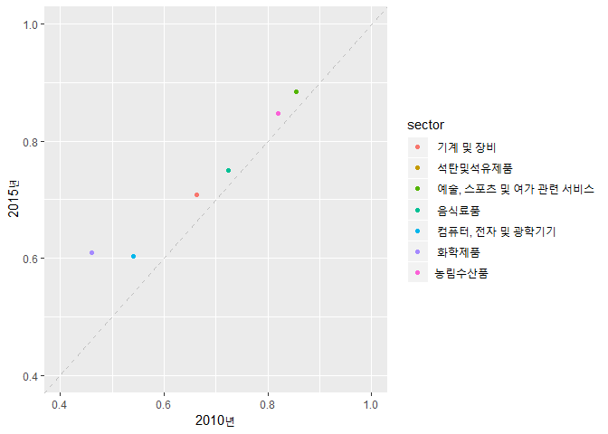

Graph
================

1.기본 세팅
-----------

``` r
rm(list=ls())
setwd("c:/Users/user/Documents/2019IO")

# 라이브러리 로딩
packages = c('tidyverse', 'openxlsx' )
lapply(packages, require, character.only = T)
```

    ## Loading required package: tidyverse

    ## Warning: package 'tidyverse' was built under R version 3.5.3

    ## -- Attaching packages -------------------------------------------------------------------------- tidyverse 1.2.1 --

    ## √ ggplot2 3.1.0       √ purrr   0.3.0  
    ## √ tibble  2.0.1       √ dplyr   0.8.0.1
    ## √ tidyr   0.8.2       √ stringr 1.4.0  
    ## √ readr   1.3.1       √ forcats 0.4.0

    ## Warning: package 'forcats' was built under R version 3.5.3

    ## -- Conflicts ----------------------------------------------------------------------------- tidyverse_conflicts() --
    ## x dplyr::filter() masks stats::filter()
    ## x dplyr::lag()    masks stats::lag()

    ## Loading required package: openxlsx

    ## Warning: package 'openxlsx' was built under R version 3.5.3

    ## [[1]]
    ## [1] TRUE
    ## 
    ## [[2]]
    ## [1] TRUE

``` r
# 데이터 로딩, 한국은행 홈페이지 2015년 기준년 산업연관표 작성결과 통계요약표의 부가가치계수 sheet를 csv파일로 저장하여 이용 
add_value_tab <- read.csv('c:/Users/user/Documents/2019IO/data/add_value_tab.csv', header = T, stringsAsFactors = F)
```

2.데이터 정리
-------------

``` r
# 데이터 개관
head(add_value_tab)
```

    ##           X.          X             X.1 X..1 X2000년.A. X..2 X2005년.B.
    ## 1 농림수산품                              ?       0.879   NA      0.860
    ## 2     광산품                              ?       0.909   NA      0.892
    ## 3 공 산 품2)                              ?       0.631   NA      0.620
    ## 4            소 비 재2)                   ?       0.738   NA      0.736
    ## 5                    ?        음식료품    ?       0.802   NA      0.775
    ## 6                    ?  섬유및가죽제품    ?       0.674   NA      0.689
    ##   X..3 X2010년.C. X..4 X2015년.D. X.2 차이.B.A. 차이.C.B. 차이.D.C. X.3
    ## 1   NA      0.820   NA      0.848  NA    -0.019    -0.039     0.028  NA
    ## 2   NA      0.868   NA      0.891  NA    -0.017    -0.023     0.023  NA
    ## 3   NA      0.577   NA      0.642  NA    -0.011    -0.043     0.066  NA
    ## 4   NA      0.674   NA      0.686  NA    -0.002    -0.061     0.012  NA
    ## 5   NA      0.723   NA      0.750  NA    -0.027    -0.052     0.027  NA
    ## 6   NA      0.621   NA      0.571  NA     0.015    -0.067    -0.050  NA
    ##   X.4
    ## 1  NA
    ## 2  NA
    ## 3  NA
    ## 4  NA
    ## 5  NA
    ## 6  NA

``` r
dim(add_value_tab)
```

    ## [1] 48 17

``` r
colnames(add_value_tab)
```

    ##  [1] "X."         "X"          "X.1"        "X..1"       "X2000년.A."
    ##  [6] "X..2"       "X2005년.B." "X..3"       "X2010년.C." "X..4"      
    ## [11] "X2015년.D." "X.2"        "차이.B.A."  "차이.C.B."  "차이.D.C." 
    ## [16] "X.3"        "X.4"

``` r
# column 이름 변경

# 'X.','X','X.1' column을 통합하여 sector column을 생성

add_value_tab <- add_value_tab %>% unite(col = 'sector', X.,X,X.1, sep = "")  
head(add_value_tab)
```

    ##              sector X..1 X2000년.A. X..2 X2005년.B. X..3 X2010년.C. X..4
    ## 1        농림수산품   ?       0.879   NA      0.860   NA      0.820   NA
    ## 2            광산품   ?       0.909   NA      0.892   NA      0.868   NA
    ## 3        공 산 품2)   ?       0.631   NA      0.620   NA      0.577   NA
    ## 4        소 비 재2)   ?       0.738   NA      0.736   NA      0.674   NA
    ## 5       ? 음식료품    ?       0.802   NA      0.775   NA      0.723   NA
    ## 6 ? 섬유및가죽제품    ?       0.674   NA      0.689   NA      0.621   NA
    ##   X2015년.D. X.2 차이.B.A. 차이.C.B. 차이.D.C. X.3 X.4
    ## 1      0.848  NA    -0.019    -0.039     0.028  NA  NA
    ## 2      0.891  NA    -0.017    -0.023     0.023  NA  NA
    ## 3      0.642  NA    -0.011    -0.043     0.066  NA  NA
    ## 4      0.686  NA    -0.002    -0.061     0.012  NA  NA
    ## 5      0.750  NA    -0.027    -0.052     0.027  NA  NA
    ## 6      0.571  NA     0.015    -0.067    -0.050  NA  NA

``` r
# NA포함 column, 차이 변수 column을 제외하고 sector, 연도 column만을 선택 

add_value_tab <- add_value_tab %>% select(sector, starts_with('X20'))
head(add_value_tab)
```

    ##              sector X2000년.A. X2005년.B. X2010년.C. X2015년.D.
    ## 1        농림수산품      0.879      0.860      0.820      0.848
    ## 2            광산품      0.909      0.892      0.868      0.891
    ## 3        공 산 품2)      0.631      0.620      0.577      0.642
    ## 4        소 비 재2)      0.738      0.736      0.674      0.686
    ## 5       ? 음식료품       0.802      0.775      0.723      0.750
    ## 6 ? 섬유및가죽제품       0.674      0.689      0.621      0.571

``` r
# 연도 column의 이름 변경 

add_value_tab <- add_value_tab %>% rename('2000년' = X2000년.A.,
                                          '2005년' = X2005년.B.,
                                          '2010년' = X2010년.C.,
                                          '2015년' = X2015년.D.)
head(add_value_tab)
```

    ##              sector 2000년 2005년 2010년 2015년
    ## 1        농림수산품  0.879  0.860  0.820  0.848
    ## 2            광산품  0.909  0.892  0.868  0.891
    ## 3        공 산 품2)  0.631  0.620  0.577  0.642
    ## 4        소 비 재2)  0.738  0.736  0.674  0.686
    ## 5       ? 음식료품   0.802  0.775  0.723  0.750
    ## 6 ? 섬유및가죽제품   0.674  0.689  0.621  0.571

``` r
# 각주 행 삭제
add_value_tab <- add_value_tab[c(-45 : -48), ]

# sector column 산업 분류명 다듬기
add_value_tab$sector <- gsub('[?]', '', add_value_tab$sector) # gsub function은 특정 문자열을 찾아 바꾸는 함수
add_value_tab$sector <- gsub('2)', '', add_value_tab$sector)
add_value_tab$sector <- gsub('3)', '', add_value_tab$sector)
head(add_value_tab)
```

    ##             sector 2000년 2005년 2010년 2015년
    ## 1       농림수산품  0.879  0.860  0.820  0.848
    ## 2           광산품  0.909  0.892  0.868  0.891
    ## 3         공 산 품  0.631  0.620  0.577  0.642
    ## 4         소 비 재  0.738  0.736  0.674  0.686
    ## 5        음식료품   0.802  0.775  0.723  0.750
    ## 6  섬유및가죽제품   0.674  0.689  0.621  0.571

``` r
# 주요 산업 부분만 추리기
add_value_tab_major <- add_value_tab[c(1, 5, 10, 11, 16, 18, 41), ]
```

그래프 그리기
-------------

``` r
ggplot(data = add_value_tab_major) +
  geom_point(mapping = aes(x = add_value_tab_major$'2010년', y = add_value_tab_major$'2015년', color = sector)) +
  xlab('2010년') + ylab('2015년') + coord_cartesian(xlim = c(0.4, 1), ylim = c(0.4, 1)) +
  geom_abline(intercept = 0, slope = 1, color = 'grey', size = 0.4, linetype = 'dashed')
```


