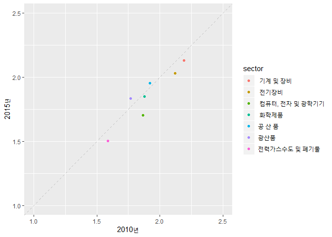
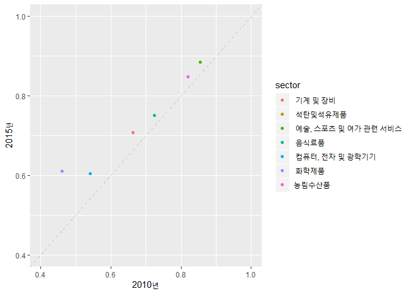

산업연관표 분석
================

작업순서

1.  ECOS류의 2015년 소분류 투입산출표를 통해 대분류 투입산출표 도출

2.  대분류 투입산출표(생산자가격\_총거래표)를 바탕으로 총투입계수 및 국산투입계수, 생산유발계수 등 도출

3.  4.  생산유발계수, 부가가치유발계수의 2010년, 2015년 연도별 비교 그래프(2015년 기준년 산업연관표 작성결과 당행 보도자료 참조)

1.기본 세팅
===========

``` r
rm(list=ls())
setwd("c:/Users/user/Documents/2019IO")

# 라이브러리 로딩
packages = c('tidyverse', 'XLConnect' )
lapply(packages, require, character.only = T)
```

    ## Loading required package: tidyverse

    ## -- Attaching packages -------------------------------------------------------------------------- tidyverse 1.2.1 --

    ## √ ggplot2 3.2.0     √ purrr   0.3.2
    ## √ tibble  2.1.3     √ dplyr   0.8.3
    ## √ tidyr   0.8.3     √ stringr 1.4.0
    ## √ readr   1.3.1     √ forcats 0.4.0

    ## -- Conflicts ----------------------------------------------------------------------------- tidyverse_conflicts() --
    ## x dplyr::filter() masks stats::filter()
    ## x dplyr::lag()    masks stats::lag()

    ## Loading required package: XLConnect

    ## Loading required package: XLConnectJars

    ## XLConnect 0.2-15 by Mirai Solutions GmbH [aut],
    ##   Martin Studer [cre],
    ##   The Apache Software Foundation [ctb, cph] (Apache POI),
    ##   Graph Builder [ctb, cph] (Curvesapi Java library)

    ## http://www.mirai-solutions.com
    ## https://github.com/miraisolutions/xlconnect

    ## [[1]]
    ## [1] TRUE
    ## 
    ## [[2]]
    ## [1] TRUE

2. 대분류 투입산출표(생산자가격\_총거래표)를 바탕으로 총투입계수 및 국산투입계수, 생산유발계수 등 도출
------------------------------------------------------------------------------------------------------

``` r
# 대분류 투입산출표 로딩
raw <- loadWorkbook("c:/Users/user/Documents/2019IO/data/IO_tab_2015_major_cat_f.xlsx")

# 생산자 가격 총거래표 sheet 로딩
data <- readWorksheet(raw, sheet = 1, startRow = 7, startCol = 3, header = F)

# 각 열의 이름 지정
colname_sector <- readWorksheet(raw, sheet = 1, startRow = 6, endRow = 6, startCol = 3, header = F) 
colnames(data) <- colname_sector

# tbl형태로 데이터 변환
data_tbl <- as_tibble(data)


# 중간수요
data_1 <- select(data_tbl, '농림수산품' : '기타')
intermediate_demand <- matrix(unlist(data_1[-c(34:40), ]), nrow = 33, byrow = F)

# 부가가치
added_value <-  unlist(data_1[39, ])

# 총투입=산출액(자가공정산출액 포함)
x <- unlist(data_1[40, ])

# 최종수요
y <- select(data_tbl, "최종수요계")
y <- unlist(y[-c(34 : 40), ])

# 수입
m <- select(data_tbl, "수입")
m <- unlist(m[-c(34 : 40), ])


# 투입계수행렬
x_1 <- matrix(rep(x, times = 33), nrow = 33, byrow = T)
A <- intermediate_demand / x_1
colnames(A) <- colname_sector[1,  1 : 33]

# 부가가치율
added_value_rate <- added_value / x

# 생산유발계수 (1)형
I <- diag(x = 1, nrow = 33)
B <- solve(I - A)
```

4-1. 생산유발계수의 2010년, 2015년 연도별 비교 그래프(2015년 기준년 산업연관표 작성결과 당행 보도자료 참조)
-----------------------------------------------------------------------------------------------------------

``` r
# 데이터 로딩, 한국은행 홈페이지 2015년 기준년 산업연관표 작성결과 통계요약표의 생산유발계수 sheet를 csv파일로 저장하여 이용 
production_inducement_tab <- read.csv('c:/Users/user/Documents/2019IO/data/production_inducement_tab.csv', header = T, stringsAsFactors = F)

# 데이터 개관
head(production_inducement_tab)
```

    ##           X.          X             X.1 X..1 X2000년.A. X..2 X2005년.B.
    ## 1 농림수산품                              ?       1.617   NA      1.733
    ## 2     광산품                              ?       1.617   NA      1.750
    ## 3 공 산 품2)                              ?       1.843   NA      1.904
    ## 4            소 비 재2)                   ?       2.040   NA      2.049
    ## 5                    ?        음식료품    ?       2.095   NA      2.078
    ## 6                    ?  섬유및가죽제품    ?       2.043   NA      2.037
    ##   X..3 X2010년.C. X..4 X2015년.D. X..5 차이.B.A. 차이.C.B. 차이.D.C.
    ## 1   NA      1.807   NA      1.799   NA     0.116     0.073    -0.007
    ## 2   NA      1.769   NA      1.836   NA     0.133     0.019     0.068
    ## 3   NA      1.921   NA      1.952   NA     0.061     0.017     0.030
    ## 4   NA      2.088   NA      2.069   NA     0.009     0.039    -0.019
    ## 5   NA      2.153   NA      2.163   NA    -0.017     0.075     0.010
    ## 6   NA      2.030   NA      1.961   NA    -0.006    -0.008    -0.069

``` r
# 데이터 정리
# 'X.','X','X.1' column을 통합하여 sector column을 생성
production_inducement_tab <- production_inducement_tab %>% unite(col = 'sector', X.,X,X.1, sep = "")  

# NA포함 column, 차이 변수 column을 제외하고 sector, 연도 column만을 선택 
production_inducement_tab <- production_inducement_tab %>% select(sector, starts_with('X20'))

# 연도 column의 이름 변경 
production_inducement_tab <- production_inducement_tab %>% rename('2000년' = X2000년.A.,
                                          '2005년' = X2005년.B.,
                                          '2010년' = X2010년.C.,
                                          '2015년' = X2015년.D.)

# 각주 행 삭제
production_inducement_tab <- production_inducement_tab[c(-45 : -48), ]

# sector column 산업 분류명 다듬기
production_inducement_tab$sector <- gsub('[?]', '', production_inducement_tab$sector) 
production_inducement_tab$sector <- gsub('2)', '', production_inducement_tab$sector)
production_inducement_tab$sector <- gsub('3)', '', production_inducement_tab$sector)

# 주요 산업 부분만 추리기
production_inducement_tab_major <- production_inducement_tab[c(2, 3, 11, 16, 17, 18, 21), ]

# 그래프 그리기 
ggplot(data = production_inducement_tab_major) +
  geom_point(mapping = aes(x = production_inducement_tab_major$'2010년', y = production_inducement_tab_major$'2015년', color = sector)) +
  xlab('2010년') + ylab('2015년') + coord_cartesian(xlim = c(1, 2.5), ylim = c(1, 2.5)) +
  geom_abline(intercept = 0, slope = 1, color = 'grey', size = 0.4, linetype = 'dashed')
```



4-2. 부가가치유발계수의 2010년, 2015년 연도별 비교 그래프(2015년 기준년 산업연관표 작성결과 당행 보도자료 참조)
---------------------------------------------------------------------------------------------------------------

``` r
# 데이터 로딩, 한국은행 홈페이지 2015년 기준년 산업연관표 작성결과 통계요약표의 부가가치계수 sheet를 csv파일로 저장하여 이용 
add_value_tab <- read.csv('c:/Users/user/Documents/2019IO/data/add_value_tab.csv', header = T, stringsAsFactors = F)

# 'X.','X','X.1' column을 통합하여 sector column을 생성
add_value_tab <- add_value_tab %>% unite(col = 'sector', X.,X,X.1, sep = "")  

# NA포함 column, 차이 변수 column을 제외하고 sector, 연도 column만을 선택 
add_value_tab <- add_value_tab %>% select(sector, starts_with('X20'))

# 연도 column의 이름 변경 
add_value_tab <- add_value_tab %>% rename('2000년' = X2000년.A.,
                                          '2005년' = X2005년.B.,
                                          '2010년' = X2010년.C.,
                                          '2015년' = X2015년.D.)

# 각주 행 삭제
add_value_tab <- add_value_tab[c(-45 : -48), ]

# sector column 산업 분류명 다듬기
add_value_tab$sector <- gsub('[?]', '', add_value_tab$sector) # gsub function은 특정 문자열을 찾아 바꾸는 함수
add_value_tab$sector <- gsub('2)', '', add_value_tab$sector)
add_value_tab$sector <- gsub('3)', '', add_value_tab$sector)

# 주요 산업 부분만 추리기
add_value_tab_major <- add_value_tab[c(1, 5, 10, 11, 16, 18, 41), ]

# 그래프 그리기
ggplot(data = add_value_tab_major) +
  geom_point(mapping = aes(x = add_value_tab_major$'2010년', y = add_value_tab_major$'2015년', color = sector)) +
  xlab('2010년') + ylab('2015년') + coord_cartesian(xlim = c(0.4, 1), ylim = c(0.4, 1)) +
  geom_abline(intercept = 0, slope = 1, color = 'grey', size = 0.4, linetype = 'dashed')
```


